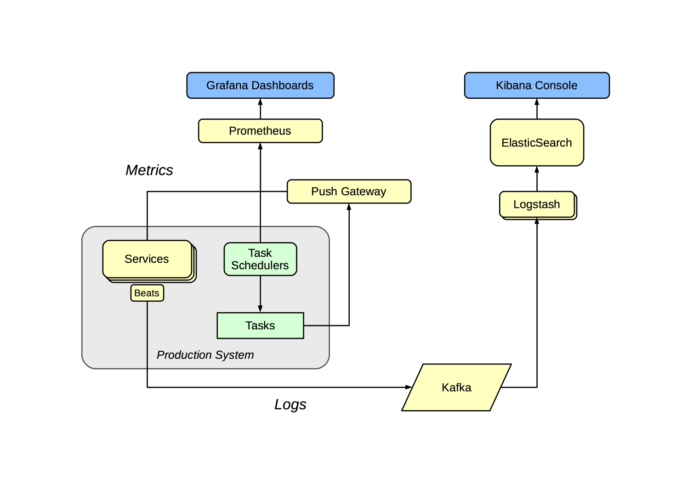

Monitoring Services
===================

We need to monitor services to raise alerts when things go wrong, to collect and track statistics on behaviour, and to allow us to debug issues when they arise. In the past, our services have been few in number, and deployed on only a few machines, and much of this has been handled using traditional tools which are not well-suited to highly 'elastic' containerised or cloud-oriented systems. ([This presentation](https://www.youtube.com/watch?v=hCBGyLRJ1qo) explores some of these issues.)

As our container-oriented crawl system is likely to contain large numbers of separate services, we need to move to a scalable approach to monitoring, based on tracking critical metrics. As elsewhere, we prefer to configure and use well-established best-of-breed open source applications to handle these kind of infrastructural issues, and attempt to minimise the amount of custom code we need.

Overall Monitoring Approach
---------------------------

Metrics are polled from services, and metrics for batch jobs cached for polling in the Push Gateway (a standard Prometheus component built for this purpose).

Useful logs and other information is siphoned off servers using [Beats](https://www.elastic.co/products/beats), buffered in Kafka, and then processed and transformed as needed with Logstash before being posted to ElasticSearch. This shorted-term cache of event information is inspected via Kibana, acting as a debugging console.

Alerts & Statistics
-------------------

The main monitoring system is focussed on exposing metrics that can be used to check the health of the system. For long-running services, this means ensuring those services are up and they are responding in a timely fashion. Batch jobs and tasks can't be queried in this way, so instead are modified to update suitable metrics upon completion, and the monitoring system checks those metrics are being updated as expected.

We use [Prometheus](https://prometheus.io/) to record and track these metrics, and [Grafana](https://grafana.com/) to provide a sutiable service summary screen. We use Prometheus's ['blackbox exporter'](https://github.com/prometheus/blackbox_exporter) to monitor generic HTTP endpoints, and the ['pushgateway'](https://prometheus.io/docs/instrumenting/pushing/) to record metrics from batch jobs.

Areas to monitor:

- Check HTTP-based services are up and responsive (in groups)
- Check HDFS storage status and increase. (requires a custom 'exporter' to scrape HTML tags)
- Check Crawler status (requires a custom 'exporter' scanning Heritrix instances and summarising metrics)
- Check Crawler local disk space etc.
- Check AMQP/Kafka queues.

Although our non-standard services require these additional ['exporters'](https://prometheus.io/docs/instrumenting/writing_exporters/) or [instrumentation](https://prometheus.io/docs/instrumenting/clientlibs/) to make the metrics available, these are simple to write and just involve re-factoring our existing monitoring code.

For batch tasks, each should post suitable metrics to the [Push Gateway](https://prometheus.io/docs/instrumenting/pushing/) when completed, and the metric dashboard and alerts should be configured to monitor that the task has executed successfully within the expected time-frame.

For example, when we back-up the W3ACT database, [once the task chain complete successfully](http://luigi.readthedocs.io/en/stable/tasks.html#events-and-callbacks), we post a timestamp and the size of the backup (in bytes) as metrics via the Push Gateway. These are polled by Prometheus, from where we can use Grafana to check that a backup has occurred in the last X hours, and that the new backup is of the expected size (roughly the same or larger than the previous backup). Raising alerts in this way, based on tests of expected outcomes, is much more robust than expecting that we will always be reliably alerted when a task fails to run.

Log Indexing & Debugging Console
--------------------------------

Service logs and other events (like crawl events) routed from servers e.g. using `filebeat` to send logs to a Kafka service from which `logstash` can consume events and then push the results to `elasticsearch`. This data can be inspected via [Kibana](https://www.elastic.co/products/kibana), which acts as a 'debugging console' that be used to work our what's happening. Using Kafka as the transport makes it possible for all such logging processes to be done in a consistent manner without them being tightly-coupled.

In contrast to the alerting & statistics system, only the recent logs are kept here. Any 'formal' reporting should be implemented as ingest or access tasks rather than done here.

Debugging of specific batch tasks should be possible via the Luigi Scheduler interfaces. In this case, the goal of the monitoring layer is to route you to the correct Luigi Scheduler and task result.

For problems with long-running services, the goal is to summarise recent activity and direct you to the problematic system or systems.

